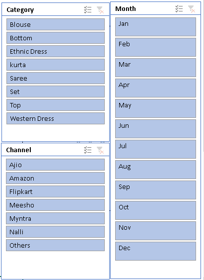

# Sales-analysis-of-store-using-excel
In this project, I have analyzed the sales of a store on different parameters and made a interactive dashboard. 
  
The image given below is the final report of my analysis.

  
Let us understand the report:
  
<b>Monthly orders</b>

This heading suggesting that the graph is telling about sales across the month. Additionally, we can see that sales of the first half of the year(2022) is higher than the second half. In the month of march, the store recorded the highest sale. On the other hand, the store recorded the lowest sale in the November

  
<b>Sales: Men vs Women</b>

The pie chart shows that the womens do more shopping than men from the store in the year 2022. In the chart, we can see that 64% are womens from the total customer of year 2022.

  
<b>Order Channels</b>

The store also gets orders from different channels like Amazon, Flipkart, Myntra, etc. So, the store earns from these channels too and this pie chart shows that the contribution of each channel in the sales.

  
<b>Orders: Age vs Gender</b>

In this chart, I tried to find out which category(Adult, Teenager, Senior)and gender do orders more from the store. Here, I find that the women from each category orders more than the men. Additionally, I got to know that the adult category women orders more than the other category.

  
<b>Top 5 cities with highest sales</b>

There is nothing more to tell about this graph. Everything is quite clear like Bengaluru is the top city with the highest sales following by the cities like Hyderabad, New Delhi, Mumbai, and Chennai.

  
<b>Top 5 states with highest sales</b>

This graph is also simple and clearly telling the story. Maharashtra is the state with highest sales foolowing by the states like Karnataka, Uttar Pradesh, Telangana, and Tamil Nadu.

  
<b>Slicers</b>

I have added some important slicers like month, category, and channel. So that I can easily analyse the sales across different parameters.

  
<b>Verdict</b>

There are some important points that I have observed during the analysis.

1) Amazon, Flipkrt, and Myntra channels are collectively contributing 80% in the sales.

2) Womens are more likely to do shopping as compared to men

3) Adults do more shopping than senior and teenager.

<b>My opinion</b>

 To grow the sales of the store, they have to target the adult category customers (30 - 49 age group) especially women that are living in states like Maharashtra, Uttar Pradesh, and Karnataka or cities like Bengaluru, New Delhi, and Mumbai. Since, their most of the sales are coming from Amazon, Flipkart, and Myntra. So, they can target that customer by showing them amazing offers and coupons.

