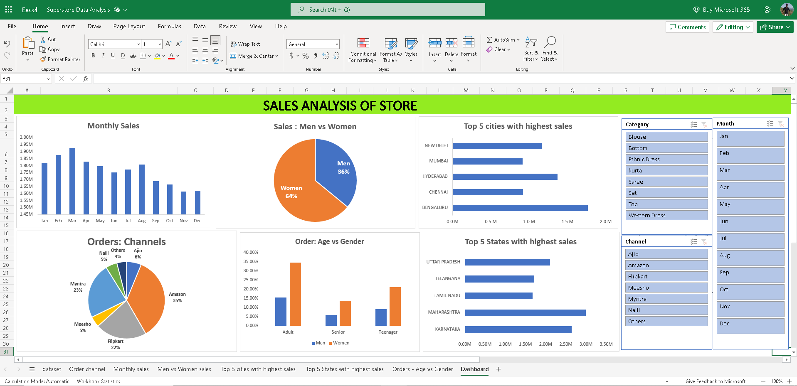

# Sales-analysis-of-store-using-excel
In this project, I have analyzed the sales of a store on different parameters and made a interactive dashboard. 
  
The image given below is the final report of my analysis.

  
Let us understand the report:
  
**Monthly orders**

This heading suggesting that the graph is telling about sales across the month. Additionally, we can see that sales of the first half of the year(2022) is higher than the second half. In the month of march, the store recorded the highest sale. On the other hand, the store recorded the lowest sale in the November

  
<b>Sales: Men vs Women</b>

The pie chart shows that the womens do more shopping than men from the store in the year 2022. In the chart, we can see that 64% are womens from the total customer of year 2022.

